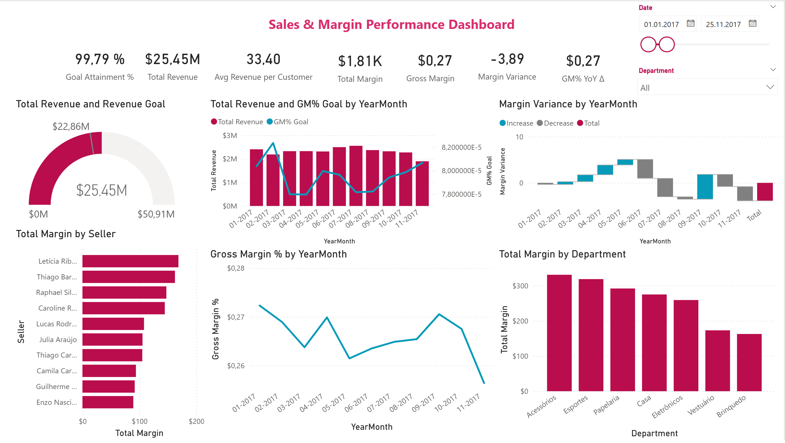
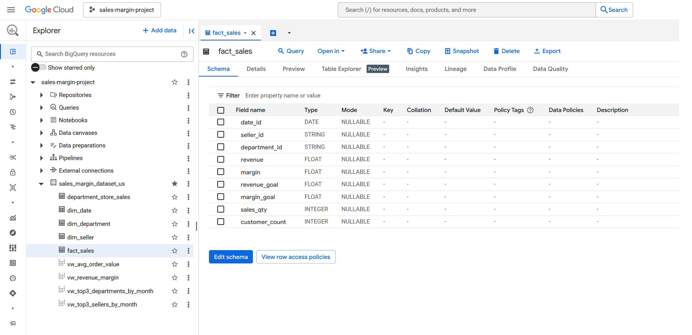
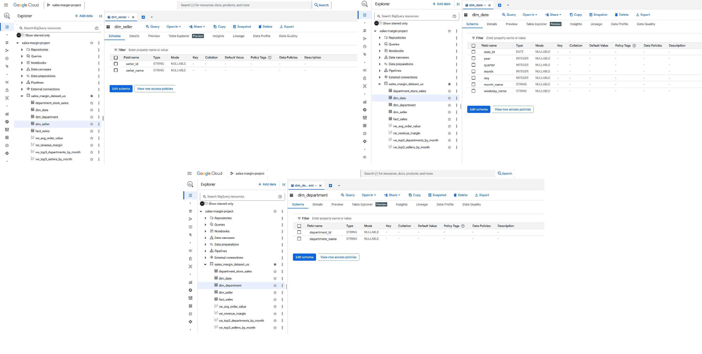

# Sales & Margin Performance (BigQuery → Power BI)

  

**TL;DR** — End-to-end analytics on retail sales and margin using **Google BigQuery** (star schema + views) and **Power BI/DAX**. The report tracks **Revenue**, **Margin**, **Gross Margin %**, **Goal Attainment**, and **Month-over-Month variance**, with quick breakdowns by **Seller** and **Department**.

**Tech**: Google BigQuery SQL • Power Query • Power BI / DAX  
**Data**: sample retail sales (US) with sellers & departments  
**Repo map**: [`sql/`](sql) • [`powerbi/`](powerbi) • [`assets/`](assets)

---

## Table of Contents
- [Background](#background)
- [Business Questions](#business-questions)
- [Dataset](#dataset)
- [Data Model](#data-model)
- [Methodology](#methodology)
- [Key DAX Measures](#key-dax-measures)
- [Dashboard](#dashboard)
- [Key Findings](#key-findings)
- [How to Reproduce](#how-to-reproduce)
- [Deliverables](#deliverables)
- [Business Recommendations](#business-recommendations)

---

## Background
This project demonstrates a **business-ready analytics workflow** that mirrors real sales management reporting. Data is modeled in a **clean star schema** in BigQuery, lightly transformed in Power Query, and surfaced in Power BI with reusable **DAX measures**. It is designed as a compact reference for KPI tracking (revenue, margin, GM%), **goal vs. actuals**, and **variance analysis** with drill-downs by seller and department.

---

## Business Questions
1. **Executive:** What are **Revenue**, **Margin**, and **Gross Margin %** over time? Are we hitting **Revenue/Margin Goals** and what is **Goal Attainment %**?  
2. **Sales Mix:** Which **sellers** and **departments** contribute most to margin and revenue?  
3. **Profitability:** How does **GM%** trend by month? Which areas dilute or lift margin?  
4. **Variance:** What months **increase** or **decrease** margin the most, and why (waterfall by YearMonth)?  
5. **Customer/SKU efficiency (views):** What is the **Average Order Value** and **Revenue per Customer**?

---

## Dataset
BigQuery project & dataset (sample): **`sales-margin-project.sales_margin_dataset_us`**. Core entities:

- **Fact**
  - `fact_sales` — transactional grain with `date_id`, `department_id`, `seller_id`, `sales_qty`, `revenue`, `margin`, `revenue_goal`, `margin_goal`, `customer_count`.
 

  

- **Dimensions**
  - `dim_date` — calendar table with `Date`, `Day`, `Month`, `Quarter`, `Year`, `YearMonth`, `YearMonthNum`, `WeekdayName`.
  - `dim_department` — department master (`department_id`, `department_name`).
  - `dim_seller` — seller master (`seller_id`, `seller_name`).
 
  

  

- **Analytical Views (BigQuery)**
  - `vw_revenue_margin` — monthly totals with **GM%** (gross margin percentage).
  - `vw_avg_order_value` — **AOV** by month/year.
  - `vw_top3_departments_by_month` — top-3 departments by **total revenue** each month.
  - `vw_top3_sellers_by_month` — top-3 sellers by **total revenue** each month.

   

  

> Utility SQL in the repo also includes **data-quality checks** (e.g., *_Check Orphan keys_ between fact and dimensions) and starter queries such as **Revenue per Customer**, **Revenue vs Goal**, and **Gross Margin % (weighted by revenue)**.

---

## Data Model

  

- **Relationships**
  - `dim_date (1) ── (∞) fact_sales[date_id]`
  - `dim_department (1) ── (∞) fact_sales[department_id]`
  - `dim_seller (1) ── (∞) fact_sales[seller_id]`
  - Views link to the appropriate dimensions for month/department/seller context.

- **Date dimension**
  - Includes full calendar attributes plus **YearMonth** text and **YearMonthNum** for correct chronological sorting in visuals.

---

## Methodology

### 1) BigQuery (source)
- Create the dataset `sales_margin_dataset_us` and load the **dimension** and **fact** tables.
- Create analytical **views**: `vw_revenue_margin`, `vw_avg_order_value`, `vw_top3_departments_by_month`, `vw_top3_sellers_by_month`.
- Run basic **data-quality** queries (orphan-key checks, null scans) before publishing to BI.

### 2) Power Query (ETL)
- Connect to BigQuery; set data types, trim/clean text, and keep only the fields required by the model.
- Optional derived columns for convenience (e.g., display-friendly **YearMonth**, safe division helpers).

### 3) Modeling (Power BI)
- Import the **Date** dimension (or mark as Date table if created in Power BI).
- Build a **star schema** (Date, Department, Seller → Fact).

### 4) Measures (DAX)
- Author reusable measures for **base KPIs**, **profitability**, **targets/variance**, and **time intelligence** (see next section).

---

## Key DAX Measures

### Base KPIs
- **Total Revenue** — sum of `fact_sales[revenue]`
- **Total Margin** — sum of `fact_sales[margin]`
- **AOV** — revenue per order/customer depending on chosen denominator
- **Revenue per Customer**

### Profitability
- **Gross Margin %** = `Total Margin ÷ Total Revenue`  
- **GM% YoY Δ**

### Targets & Variance
- **Revenue Goal**, **Margin Goal**  
- **Goal Attainment %** = `Total Revenue ÷ Revenue Goal`  
- **Margin Variance** (waterfall friendly)  
- **Revenue YoY %**

### Time Intelligence
- **Revenue MTD/YTD**, **Revenue LY**, **YoY%**  
- Equivalent patterns can be added for **Margin** and **GM%**.

> The repo groups measures (e.g., `zz_Measures`) to keep the field list tidy and visuals consistent.

---

## Dashboard

   

**Sales & Margin Performance (one page)**  
- **KPI cards:** Goal Attainment %, Total Revenue, Avg Revenue per Customer, Total Margin, Gross Margin %.  
- **Gauge:** **Total Revenue vs Revenue Goal**.  
- **Trend:** **Total Revenue & GM% by YearMonth**.  
- **Variance (waterfall):** **Margin Variance by YearMonth** with increase/decrease breakdown.  
- **By Seller:** **Total Margin by Seller** (bar).  
- **By Department:** **Total Margin by Department** (bar).  
- **Slicers:** **Date range** and **Department**.

---

## Key Findings
- Margin and revenue are **concentrated in a small set of sellers/departments**, highlighted by the *Top-3 by month* views.  
- **GM%** trends smoothly month-to-month, with **variance spikes** clearly visible in the waterfall to focus investigation.  
- **Goal tracking** keeps attention on execution: the gauge and goal-attainment KPI make it obvious when revenue is off-pace.

---

## Reproducibility Note
This project was developed end-to-end in **Google BigQuery**, where all **tables** and **analytical views** were created and queried directly, then connected to **Power BI** for modeling and visualization.  

The included SQL DDLs (for tables) and view scripts provide a complete reference implementation to recreate the schema in any environment — BigQuery, SQL Server, or a local setup.

If you wish to reproduce similar results, you can rebuild the model using the [Department Store Sales Dataset](https://www.kaggle.com/datasets/raphaelpuziol/department-store-sales-dataset) as the source, following the table and view definitions provided in the `sql/` directory.

---
## Deliverables

- **Power BI report:** [`sales-margin-project.pbix`](./sales-margin-project.pbix)

- **SQL scripts:** (stored in [`/sql`](./sql))
  - **Dimensions**
    - [`Date Dimension.sql`](./sql/Date%20Dimension.sql)
    - [`Department Dimension.sql`](./sql/Department%20Dimension.sql)
    - [`Seller Dimension.sql`](./sql/Seller%20Dimension.sql)
  - **Fact**
    - [`Fact Table.sql`](./sql/Fact%20Table.sql)
  - **KPIs / Aggregates**
    - [`Total Revenue.sql`](./sql/Total%20Revenue.sql)
    - [`Gross Margin _(weighted by revenue).sql`](./sql/Gross%20Margin%20_%28weighted%20by%20revenue%29.sql)
    - [`Average Order Value.sql`](./sql/Average%20Order%20Value.sql)
    - [`Revenue per Customer.sql`](./sql/Revenue%20per%20Customer.sql)
    - [`Sales per Customer.sql`](./sql/Sales%20per%20Customer.sql)
    - [`Revenue vs Goal.sql`](./sql/Revnue%20vs%20Goal.sql)
    - [`margin amount vs margin goal amount.sql`](./sql/margin%20amount%20vs%20margin%20goal%20amount.sql)
  - **Analytical (Top 3)**
    - [`top3_departments_by_month.sql`](./sql/top3_departments_by_month.sql)
    - [`top3_sellers_by_month.sql`](./sql/top3_sellers_by_month.sql)
  - **Data Quality / Checks**
    - [`Check Orphan keys.sql`](./sql/Check%20Orphan%20keys.sql)
    - [`Run-checks.sql`](./sql/Run-checks.sql)
    - [`Run Check for top3_Dep.sql`](./sql/Run%20Check%20for%20top3_Dep.sql)
    - [`Run Check for top3_Slr.sql`](./sql/Run%20Check%20for%20top3_Slr.sql)

- **Assets (Screenshots):** [`/assets`](./assets)

---

## Business Recommendations
1. **Double-down on top sellers & departments.** Maintain stock and campaign priority where margin density is highest.  
2. **Lift GM%** in lower-performing areas via pricing tests, bundles, or supplier negotiations.  
3. **Track variance monthly.** Investigate months with large negative bars in the **Margin Variance** waterfall.  
4. **Use goals actively.** Revisit **Revenue/Margin Goals** quarterly and align incentives to **Goal Attainment %**.

---
