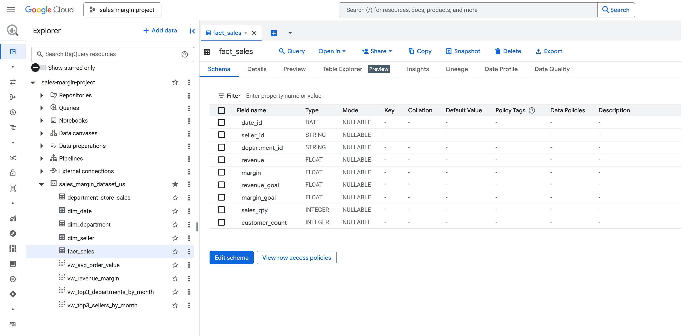
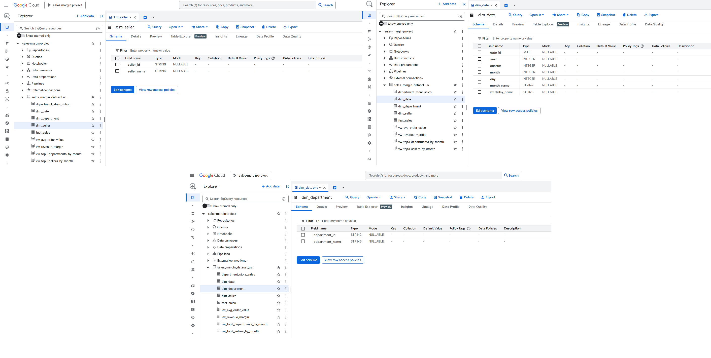

# Umsatz- & Margen-Performance (BigQuery → Power BI)

  

**TL;DR** — End-to-End-Analytics zu Retail-Umsatz und -Marge mit **Google BigQuery** (Sternschema + Views) und **Power BI/DAX**. Der Bericht verfolgt **Umsatz**, **Marge**, **Bruttomarge %**, **Zielerreichung** und **Monatsvergleich (MoM-Varianz)** – mit schnellen Aufschlüsselungen nach **Verkäufer** und **Abteilung**.

**Tech**: Google BigQuery SQL • Power Query • Power BI / DAX  
**Daten**: Beispielhafte Retail-Umsätze (USA) mit Verkäufern & Abteilungen  
**Repo-Struktur**: [`sql/`](sql) • [`powerbi/`](powerbi) • [`assets/`](assets)

---

## Inhaltsverzeichnis
- [Hintergrund](#hintergrund)
- [Geschäftsfragen](#geschäftsfragen)
- [Datensatz](#datensatz)
- [Datenmodell](#datenmodell)
- [Methodik](#methodik)
- [Wichtige DAX-Maße](#wichtige-dax-mäße)
- [Dashboard](#dashboard)
- [Zentrale Erkenntnisse](#zentrale-erkenntnisse)
- [So reproduzierst du es](#so-reproduzierst-du-es)
- [Artefakte](#artefakte)
- [Business-Empfehlungen](#business-empfehlungen)

---

## Hintergrund
Dieses Projekt demonstriert einen **business-tauglichen Analytics-Workflow**, der echtes Vertriebs-Reporting abbildet. Die Daten werden in BigQuery in einem **sauberen Sternschema** modelliert, in Power Query leicht transformiert und in Power BI mit wiederverwendbaren **DAX-Maßen** visualisiert. Es dient als kompakte Referenz für KPI-Tracking (Umsatz, Marge, GM%), **Soll-Ist-Vergleich** und **Varianzanalysen** mit Drilldowns nach Verkäufer und Abteilung.

---

## Geschäftsfragen
1. **Executive:** Wie entwickeln sich **Umsatz**, **Marge** und **Bruttomarge %** über die Zeit? Erreichen wir **Umsatz-/Margenziele** und wie hoch ist die **Zielerreichung %**?  
2. **Sales Mix:** Welche **Verkäufer** und **Abteilungen** tragen am meisten zu Marge und Umsatz bei?  
3. **Profitabilität:** Wie verläuft die **GM%** (Bruttomarge) nach Monaten? Welche Bereiche drücken oder heben die Marge?  
4. **Varianz:** In welchen Monaten **steigt** oder **fällt** die Marge am stärksten – und warum (Waterfall nach YearMonth)?  
5. **Effizienz Kunde/SKU (Views):** Wie hoch sind **Durchschnittlicher Bestellwert (AOV)** und **Umsatz pro Kunde**?

---

## Datensatz
BigQuery-Projekt & Dataset (Beispiel): **`sales-margin-project.sales_margin_dataset_us`**. Kern-Entitäten:

- **Fakt**
  - `fact_sales` — transaktionale Granularität mit `date_id`, `department_id`, `seller_id`, `sales_qty`, `revenue`, `margin`, `revenue_goal`, `margin_goal`, `customer_count`.
 

  

- **Dimensionen**
  - `dim_date` — Kalendertabelle mit `Date`, `Day`, `Month`, `Quarter`, `Year`, `YearMonth`, `YearMonthNum`, `WeekdayName`.
  - `dim_department` — Abteilungsstamm (`department_id`, `department_name`).
  - `dim_seller` — Verkäuferstamm (`seller_id`, `seller_name`).
 
  

  

- **Analytische Views (BigQuery)**
  - `vw_revenue_margin` — Monatssummen inkl. **GM%** (Bruttomarge in %).
  - `vw_avg_order_value` — **AOV** nach Monat/Jahr.
  - `vw_top3_departments_by_month` — Top-3-Abteilungen nach **Gesamtumsatz** je Monat.
  - `vw_top3_sellers_by_month` — Top-3-Verkäufer nach **Gesamtumsatz** je Monat.

   

  

> Utility-SQL im Repo umfasst außerdem **Data-Quality-Checks** (z. B. *verwaiste Keys* zwischen Fakt und Dimensionen) sowie Startabfragen wie **Umsatz pro Kunde**, **Umsatz vs. Ziel** und **Bruttomarge % (umsatzgewichtet)**.

---

## Datenmodell

  

- **Beziehungen**
  - `dim_date (1) ── (∞) fact_sales[date_id]`
  - `dim_department (1) ── (∞) fact_sales[department_id]`
  - `dim_seller (1) ── (∞) fact_sales[seller_id]`
  - Views bringen den passenden Kontext für Monat/Abteilung/Verkäufer.

- **Datumsdimension**
  - Enthält alle Kalenderattribute sowie **YearMonth** (Text) und **YearMonthNum** für korrekte chronologische Sortierung in Visuals.

---

## Methodik

### 1) BigQuery (Quelle)
- Dataset `sales_margin_dataset_us` erstellen und **Dimensionen** sowie **Fakt** laden.
- Analytische **Views** anlegen: `vw_revenue_margin`, `vw_avg_order_value`, `vw_top3_departments_by_month`, `vw_top3_sellers_by_month`.
- Vor dem BI-Publish **Datenqualitätsabfragen** ausführen (Prüfung verwaister Keys, Null-Scans).

### 2) Power Query (ETL)
- Verbindung zu BigQuery herstellen; Datentypen setzen, Texte trimmen/cleanen und nur felderhaltende Spalten behalten.
- Optionale abgeleitete Spalten (z. B. benutzerfreundliches **YearMonth**, Safe-Division-Helper).

### 3) Modellierung (Power BI)
- **Date**-Dimension importieren (oder als Datumstabelle in Power BI markieren).
- **Sternschema** aufbauen (Date, Department, Seller → Fact).

### 4) Measures (DAX)
- Wiederverwendbare Maße für **Basis-KPIs**, **Profitabilität**, **Ziele/Varianz** und **Time Intelligence** erstellen (siehe nächster Abschnitt).

---

## Wichtige DAX-Maße

### Basis-KPIs
- **Total Revenue** — Summe von `fact_sales[revenue]`
- **Total Margin** — Summe von `fact_sales[margin]`
- **AOV** — Umsatz je Bestellung/Kunde je nach Nenner
- **Revenue per Customer**

### Profitabilität
- **Gross Margin %** = `Total Margin ÷ Total Revenue`  
- **GM% YoY Δ**

### Ziele & Varianz
- **Revenue Goal**, **Margin Goal**  
- **Goal Attainment %** = `Total Revenue ÷ Revenue Goal`  
- **Margin Variance** (geeignet für Waterfall)  
- **Revenue YoY %**

### Time Intelligence
- **Revenue MTD/YTD**, **Revenue LY**, **YoY%**  
- Entsprechende Muster lassen sich für **Margin** und **GM%** ergänzen.

> Im Repo werden Maße (z. B. in `zz_Measures`) gruppiert, um die Feldliste übersichtlich zu halten und Visuals konsistent zu gestalten.

---

## Dashboard

   

**Sales & Margin Performance (eine Seite)**  
- **KPI-Karten:** Goal Attainment %, Total Revenue, Avg Revenue per Customer, Total Margin, Gross Margin %.  
- **Gauge:** **Total Revenue vs Revenue Goal**.  
- **Trend:** **Total Revenue & GM% nach YearMonth**.  
- **Varianz (Waterfall):** **Margin Variance nach YearMonth** mit Auf-/Abwärtsbeiträgen.  
- **Nach Verkäufer:** **Total Margin nach Seller** (Balken).  
- **Nach Abteilung:** **Total Margin nach Department** (Balken).  
- **Slicer:** **Zeitraum** und **Abteilung**.

---

## Zentrale Erkenntnisse
- Marge und Umsatz sind **auf wenige Verkäufer/Abteilungen konzentriert** – erkennbar in den *Top-3 je Monat*-Views.  
- **GM%** verläuft von Monat zu Monat glatt; **Varianzspitzen** sind im Waterfall klar sichtbar und lenken Analysen.  
- **Zielverfolgung** hält den Fokus auf Umsetzung: Gauge und KPI „Zielerreichung“ zeigen früh, wenn der Umsatz hinterherhinkt.

---

## Hinweis zur Reproduzierbarkeit
Das Projekt wurde End-to-End in **Google BigQuery** entwickelt: **Tabellen** und **analytische Views** wurden dort erstellt/abgefragt und anschließend mit **Power BI** für Modellierung und Visualisierung verbunden.  

Die enthaltenen SQL-DDLs (für Tabellen) und View-Skripte liefern eine vollständige Referenzimplementierung, um das Schema in jeder Umgebung neu aufzubauen — BigQuery, SQL Server oder lokal.

Wer ähnliche Ergebnisse reproduzieren möchte, kann das Modell mit dem [Department Store Sales Dataset](https://www.kaggle.com/datasets/raphaelpuziol/department-store-sales-dataset) nachbauen und den Definitionen in `sql/` folgen.

---
## Ergebnisse (Deliverables)

- **Power BI-Report:** [`sales-margin-project.pbix`](./sales-margin-project.pbix)

- **SQL-Skripte:** (gespeichert in [`/sql`](./sql))
  - **Dimensionen**
    - [`Date Dimension.sql`](./sql/Date%20Dimension.sql)
    - [`Department Dimension.sql`](./sql/Department%20Dimension.sql)
    - [`Seller Dimension.sql`](./sql/Seller%20Dimension.sql)
  - **Fakt**
    - [`Fact Table.sql`](./sql/Fact%20Table.sql)
  - **KPIs / Aggregationen**
    - [`Total Revenue.sql`](./sql/Total%20Revenue.sql)
    - [`Gross Margin _(weighted by revenue).sql`](./sql/Gross%20Margin%20_%28weighted%20by%20revenue%29.sql)
    - [`Average Order Value.sql`](./sql/Average%20Order%20Value.sql)
    - [`Revenue per Customer.sql`](./sql/Revenue%20per%20Customer.sql)
    - [`Sales per Customer.sql`](./sql/Sales%20per%20Customer.sql)
    - [`Revenue vs Goal.sql`](./sql/Revnue%20vs%20Goal.sql)
    - [`margin amount vs margin goal amount.sql`](./sql/margin%20amount%20vs%20margin%20goal%20amount.sql)
  - **Analytik (Top 3)**
    - [`top3_departments_by_month.sql`](./sql/top3_departments_by_month.sql)
    - [`top3_sellers_by_month.sql`](./sql/top3_sellers_by_month.sql)
  - **Datenqualität / Checks**
    - [`Check Orphan keys.sql`](./sql/Check%20Orphan%20keys.sql)
    - [`Run-checks.sql`](./sql/Run-checks.sql)
    - [`Run Check for top3_Dep.sql`](./sql/Run%20Check%20for%20top3_Dep.sql)
    - [`Run Check for top3_Slr.sql`](./sql/Run%20Check%20for%20top3_Slr.sql)

- **Assets (Screenshots):** [`/assets`](./assets)

---

## Business-Empfehlungen
1. **Top-Verkäufer & -Abteilungen weiter stärken.** Bestand & Kampagnen dort priorisieren, wo die Margendichte am höchsten ist.  
2. **GM% heben** in schwächeren Bereichen durch Preistests, Bundles oder Lieferantenverhandlungen.  
3. **Monatliche Varianz verfolgen.** Monate mit großen negativen Balken in der **Margin Variance**-Waterfall gezielt untersuchen.  
4. **Ziele aktiv nutzen.** **Umsatz-/Margenziele** quartalsweise prüfen und Anreize an **Zielerreichung %** koppeln.

---
